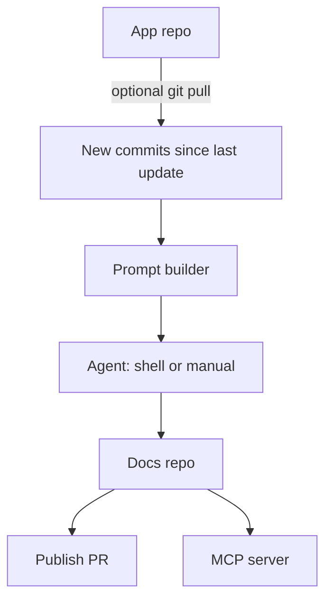

# DocFlow

Agent-powered documentation from git activity. DocFlow writes dual-audience docs (Markdown for humans, JSON for LLMs) by generating focused prompts any coding agent can run — Antigravity, Cursor, Claude Code, Cline, and others. No vendor LLM API key.

## Quickstart

```bash
git clone https://github.com/debjit/docflow.git
cd docflow
python3 -m venv .venv
source .venv/bin/activate
pip install -e .
```

From your application repo (the docs folder must be empty the first time):

```bash
docflow init
docflow pull
docflow generate
```

| Command | What it does |
| --- | --- |
| `docflow init` | Pair app + docs. Defaults: `architecture`, `database`, `models`, `functions`, `routes`, `pages`. |
| `docflow pull` | `git pull` on the app repo, then list commits not yet documented. |
| `docflow generate` | Update existing docs from **new commits only**. |
| `docflow import --from PATH --type NAME` | Copy files into a type folder. Never overwrites. |
| `docflow generate --full` | Rebuild docs. Init cannot be run twice. |
| `docflow ui` | Full-screen UI. |
| `docflow projects` | List / open / add / remove docs projects. |
| `docflow` | Interactive menu (TTY). |

## Features

- One application repo paired with one docs repo
- User-defined doc types (folders). Import later without overwriting
- Remembers the last documented commit so generate does not repeat the same range
- `index.md` + `context.json` per section
- MCP server (`stdio` / `sse`)
- Publish a docs branch and open a PR/MR (GitHub, GitLab, Bitbucket)

## Workflow



## Docs repo layout

```text
docs-repo/
├── architecture/                # one overview
├── database/<unit>/
├── models/<unit>/
├── functions/<unit>/
├── routes/<unit>/
├── pages/<unit>/
├── llms.txt
├── llms-full.txt
└── .docflow/                    # machinery, not docs
    ├── config.yml
    ├── state.json
    ├── stack.json
    ├── CONVENTIONS.md
    └── prompts/
        ├── pending/
        └── completed/
```

Application docs live in type folders. Config, prompts, and generate state live in `.docflow/`.

## Configuration

Project config lives only in the **docs** repo (`.docflow/config.yml`). DocFlow does not write into the application source tree. `docflow projects` lists and switches docs projects from a user index (`$XDG_CONFIG_HOME/docflow/projects.yml`).

`.docflow/config.yml` in the docs repo:

```yaml
project:
  name: "MyApplication"

app:
  repo_path: "/path/to/app-repo"

docs:
  repo_path: "/path/to/docs-repo"
  types:
    - name: architecture
      description: System layout, hosting, and packages this app uses
    - name: database
      description: Schema and migrations
    - name: models
      description: Domain models
    - name: functions
      description: Application services, jobs, actions, and controllers
    - name: routes
      description: HTTP routes
    - name: pages
      description: UI pages and indexes

agent:
  mode: "shell"   # or "manual"
  command: 'agy --dangerously-skip-permissions --add-dir {docs_repo} -p "Follow every instruction in {prompt_file}."'

platform:
  type: "github"  # github | gitlab | bitbucket | generic
  auto_mr: true

generation:
  full_diff_threshold: 200
  framework: auto   # auto | none | laravel
  ignore:
    - "*.lock"
    - "node_modules/"
    - "dist/"
    - "__pycache__/"
```

- **`generation.framework`**: `auto` detects Laravel and applies framework-aware ignore rules; `laravel` forces the Laravel profile; `none` skips detection (still ignores `vendor/`).
- **`generation.ignore`**: merged with DocFlow defaults and framework profiles during scan and diff.
- **`generation.features`**: units selected during init. Later `generate` only updates those sections.
- **Section picker**: after the agent inspects composer/packages and app structure, init lists application units (models, routes, pages, …). CLI glue such as `main`/`menu` is not listed. `--yes` skips the picker (CI).
- **`.docflow/stack.json`**: written during init by a stack survey agent job; later prompts use its `guidance` to focus on application code, not framework internals.

- **shell**: DocFlow runs your CLI agent; prompts move from `.docflow/prompts/pending/` to `.docflow/prompts/completed/`.
- **manual**: Prompts stay in `.docflow/prompts/pending/` with exact output paths.

`docflow status` (alias `docflow info`) shows types, last documented commit, and new commits. It does not write `status/wip.md`.

## CI

```bash
docflow init --repo /path/to/app-repo --docs /path/to/docs-repo --agent manual --fresh
docflow generate --repo /path/to/app-repo --docs /path/to/docs-repo
docflow pull --repo /path/to/app-repo --docs /path/to/docs-repo
docflow import --docs /path/to/docs-repo --from /path/to/files --type front-end
docflow status --repo /path/to/app-repo --docs /path/to/docs-repo
docflow publish --docs /path/to/docs-repo --platform github
docflow serve --docs /path/to/docs-repo --transport stdio
```

If `pip` is missing after `venv`:

```bash
python3 -m venv --without-pip .venv
curl -sS https://bootstrap.pypa.io/get-pip.py | .venv/bin/python3
.venv/bin/pip install -e .
```

## Tests

```bash
pytest -v
```

## License

[MIT](LICENSE)
